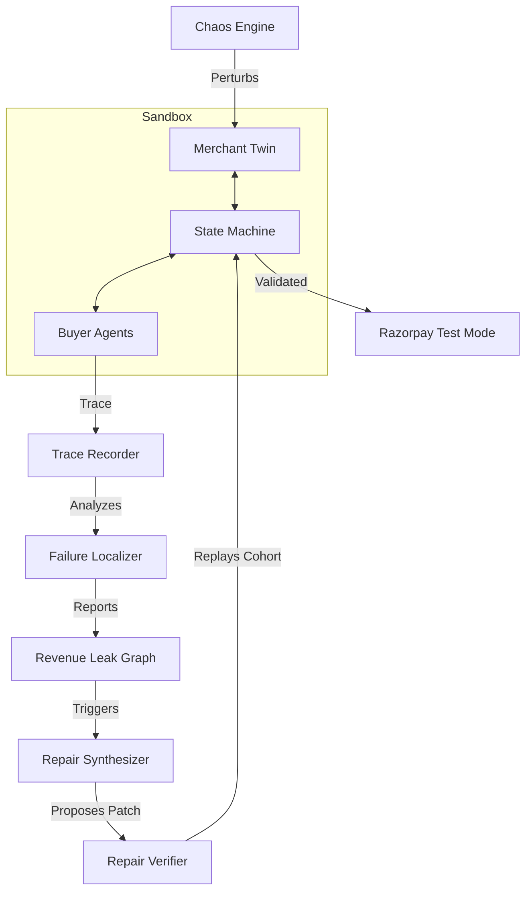

# CommerceTwin

**CommerceTwin creates a digital twin of a merchant, sends heterogeneous synthetic AI buyers through commerce workflows, injects controlled commerce failures, localizes where agentic revenue is leaking, generates bounded catalog repairs from authoritative same-SKU evidence, and verifies repairs by replaying the exact failed transaction in a sandbox.**

## Why It Matters (Track 01 — AI Growth & Agentic Commerce)
AI-readable does not mean AI-transactable. CommerceTwin addresses the gap between AI understanding a catalog and actually completing a checkout securely. It demonstrates that to grow agentic commerce reliably, merchants need automated environments to inject chaos, trace failures, and apply deterministic, evidence-backed repairs verified through counterfactual replay before gating payments.

## Architecture Diagram


## Core Loop
`SIMULATE → PERTURB → TRACE → LOCALIZE → REPAIR → REPLAY → VERIFY → GATE PAYMENT`

The design follows a simple rule:

**AI may propose; deterministic commerce checks decide.**

## What is Genuinely Implemented
* **Merchant Digital Twin**: Synthetic merchant catalog, typed product attributes, pricing, inventory, and merchant-policy state.
* **AI Buyer Configurations**: Structured, semantic, and hybrid buyer configurations for exercising commerce workflows.
* **Deterministic Commerce State Machine**: Tracks transactions from discovery and evaluation through deterministic prechecks and payment readiness.
* **Chaos Engine**: Injects controlled catalog, context, inventory, pricing, checkout, and payment-side failures into isolated merchant state.
* **Canonical Transaction Tracing**: Persists buyer and commerce-state events for failure analysis and replay.
* **Failure Localization**: Maps failed transactions to defined commerce failure classes and affected SKUs.
* **Evidence-Backed Repair Engine**: Generates bounded catalog repairs only when authoritative same-SKU evidence is available.
* **Exact Replay Verification**: Reconstructs the frozen failed transaction state, applies the proposed repair in a sandbox, reruns the original intent, and validates the result with a deterministic IntentOracle.
* **Razorpay Test Mode Integration**: Provides server-authoritative payment-order creation, local idempotency controls, signature/webhook validation, and payment-state tracking.
* **React Dashboard**: Surfaces experiments, traces, revenue leaks, repairs, replays, and payment operations.

## Evaluation Scope
CommerceTwin's benchmark evaluates **checkout readiness**, not live payment completion.

Each benchmark transaction runs through:
`INTENT → DISCOVERY → EVALUATION → SELECTION → PRECHECK → READY_FOR_PAYMENT`

A transaction is considered successful when it safely reaches `READY_FOR_PAYMENT` while preserving the buyer's hard constraints.

Razorpay Test Mode is tested as a **separate payment-integration pathway** rather than being executed for every benchmark scenario.

## Measured Held-Out Results
A frozen synthetic held-out set of **100 eligible buyer scenarios** was evaluated with deterministic commerce faults enabled.

| Metric | Result |
|---|---|
| Robust Transaction Yield (RTY) | **0.930** |
| RTY 95% CI | **[0.880, 0.980]** |
| Intent Integrity (II) | **1.000** |
| II 95% CI | **[1.000, 1.000]** |
| Constraint Violation Rate (CVR) | **0.000** |
| Failure Recovery Rate (FRR) | **0.000** |
| Total Successful | **93 / 100** |
| Total Failed | **7 / 100** |
| Total Recovered in held-out benchmark | **0** |
| Recovered Eligible Value (REV) | **₹0** |
| Agentic Value at Risk (AVaR) | **₹38,716.88** |
| Mean latency | **693.31 ms** |
| Median latency | **705.99 ms** |
| p95 latency | **747.0 ms** |

The benchmark demonstrates **93% checkout-readiness yield with 100% intent integrity and zero hard-constraint violations**.

The automatic repair mechanism is evaluated separately through deterministic recovery regression tests rather than being credited for recoveries that did not occur in the held-out benchmark.

**Held-out evaluation source commit:**
`f74499beac7841ed9eda8b8b5bd14fb5e4e4b19e`

**Held-out dataset SHA-256:**
`41e78c506af8632abedbd9aeba1d384eae7681baee16fcb88d29125fa98f9880`

## Evidence-Backed Recovery Story
CommerceTwin includes a deterministic end-to-end recovery regression for a missing typed product attribute (`backend/tests/test_full_recovery_path.py`).

The controlled scenario begins with a charger whose authoritative merchant record contains:
`power_watts = 65`

The Chaos Engine removes `power_watts` from the sandbox catalog. A buyer with a hard requirement of at least `65W` then rejects the product, causing the original transaction to reach `ABORTED`.

CommerceTwin then:
1. Localizes the missing typed attribute;
2. Identifies the affected SKU;
3. Retrieves authoritative evidence for the **same SKU**;
4. Generates a bounded repair restoring `power_watts = 65`;
5. Reconstructs the original frozen transaction snapshot;
6. Applies only the proposed repair;
7. Reruns the original buyer intent using the original seed, pricing, inventory, and merchant policy;
8. Reaches `READY_FOR_PAYMENT`; and
9. Passes the deterministic `IntentOracle`.

The regression additionally verifies that the replay has a distinct trace identity and that `ReplayResult.success = true`.

This proves that the repair architecture can recover a known repairable fault under controlled deterministic conditions. It is intentionally reported separately from the held-out benchmark, where no failed scenario was automatically recovered.

## Razorpay Test Mode Integration
CommerceTwin includes a separate Razorpay Test Mode integration for payment-order creation and payment event handling.

Important design boundaries include:
* Payment amounts are derived by the backend rather than trusted from the browser;
* Payment operations have deterministic local fingerprints;
* Payment operations are persisted before external side effects where applicable;
* Webhook events are processed idempotently;
* Signatures and transaction amounts are validated;
* AI agents cannot authorize payments or bypass deterministic commerce checks.

The integration is intended as a **Test Mode engineering demonstration**, not as a claim of production-grade exactly-once payment execution.

## Quick Start
```bash
git clone https://github.com/bnssaanirudh/commercetwin.git
cd commercetwin
python -m venv venv
# Windows:
.\venv\Scripts\Activate.ps1
# Linux/macOS:
source venv/bin/activate
pip install -e ".[dev]"
```

## Environment Variables
Create a `.env` in the root (see `.env.example`):
```env
APP_ENV=development
APP_DEBUG=true
RAZORPAY_KEY_ID=rzp_test_...
RAZORPAY_KEY_SECRET=...
```

## Test Commands
Run the test suite locally:
```bash
# Windows
.\scripts\test_all.ps1

# Linux / macOS
./scripts/test_all.sh
```

## Benchmark & Recovery Commands
Run the controlled recovery demo:
```bash
python scripts/run_demo.py
```

Run the benchmark evaluation:
```bash
python evals/run_benchmark.py --system commercetwin --split val --seed 42
```

## Repository Structure
- `/backend`: FastAPI server, state machines, trace recorders, and localizers.
- `/frontend`: Vite + React dashboard for visualizing traces, leaks, repairs, and replays.
- `/scripts`: Automation, dataset audits, and demo orchestrators.
- `/data`: Frozen synthetic buyer intents, merchant catalogs, and benchmark splits.
- `/evals`: Benchmark execution harnesses and reporting.

## Limitations
* The evaluation uses synthetic merchants and synthetic buyer intents; the reported metrics do not demonstrate real-world revenue uplift.
* The 100-scenario benchmark measures checkout readiness up to `READY_FOR_PAYMENT`; it does not execute a Razorpay transaction for every benchmark scenario.
* The held-out benchmark produced **0 automatic recoveries**. Recovery capability is instead demonstrated through a controlled deterministic regression scenario.
* Automatic repair currently supports a bounded set of failure classes and requires authoritative evidence. If trustworthy same-SKU evidence is unavailable, the correct behavior is manual review rather than factual invention.
* Razorpay integration uses Test Mode and should not be interpreted as a production payment-processing guarantee.
* Production-grade payment reconciliation, distributed concurrency handling, and broader merchant-system integrations remain future work. See `LIMITATIONS.md` for details.

## Result Summary
CommerceTwin currently demonstrates three separate capabilities:
1. **Robust checkout readiness**: 93% held-out RTY with 100% intent integrity and 0% constraint violations.
2. **Deterministic repair verification**: A complete controlled failure → localization → same-SKU repair → exact replay → oracle-valid recovery path.
3. **Safe payment gating**: A separate Razorpay Test Mode integration in which payment execution occurs only after deterministic commerce validation.
