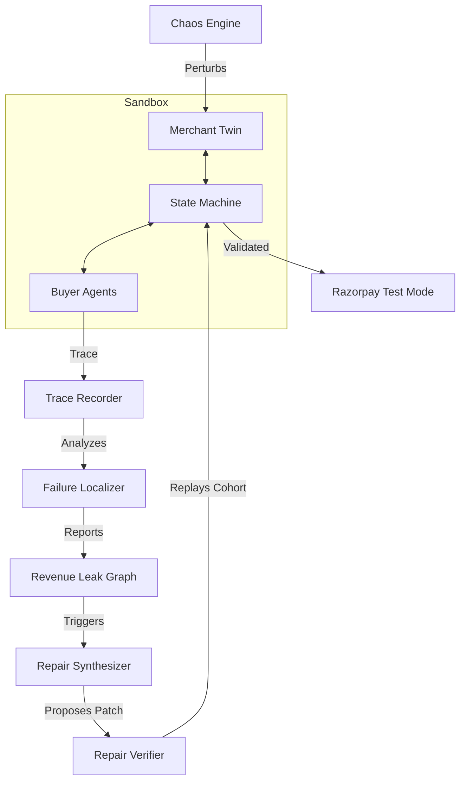

# CommerceTwin

**CommerceTwin creates a digital twin of a merchant, sends heterogeneous synthetic AI buyers through complete shopping and Razorpay Test Mode transactions, injects controlled commerce failures, localizes where agentic revenue is leaking, proposes the smallest merchant-side repair, and verifies that repair by replaying the exact failed cohort.**

## Why It Matters (Track 01 — AI Growth & Agentic Commerce)
AI-readable does not mean AI-transactable. CommerceTwin addresses the gap between AI understanding a catalog and actually completing a checkout securely. It proves that to grow agentic commerce, merchants need automated labs to inject chaos, trace failures, and apply deterministic repairs that are mathematically verified through counterfactual replay.


## Architecture Diagram


## Core Loop
`SIMULATE → TRANSACT → PERTURB → TRACE → LOCALIZE → REPAIR → REPLAY → PROVE`

## What is Genuinely Implemented
- **Synthetic Merchant**: 120+ products, explicit typed policies.
- **AI Buyers**: Structured, Semantic, and Hybrid buyer configurations.
- **Strict State Machine**: Monotonic execution tracking from discovery to payment.
- **Chaos Engine**: Injects context, catalog, inventory, checkout, and payment failures.
- **Repair Engine**: Localizes missing attributes/policies and proposes AST-level patches.
- **Replay Verifier**: Applies patches in a sandbox and reruns the exact failed trace to prove success.
- **Payments**: Full Razorpay Test Mode integration with idempotency.

## Why AI is Used
AI is utilized for generating synthetic natural-language buyer intents, executing semantic searches across ambiguous catalogs, and synthesizing proposed JSON patches to fix missing catalog attributes.

## Where AI is Intentionally NOT Used
AI is **never** used to authorize payments, bypass hard constraints, rewrite merchant core policies, or override deterministic inventory/pricing checks. All repairs must be verified by a deterministic replay sandbox before acceptance.

## Razorpay Test Mode Integration
CommerceTwin integrates directly with Razorpay Test Mode to create server-side orders and validate them. It strictly isolates Razorpay secrets within the backend config layer, preventing them from ever leaking into agent prompts or logs. It uses deterministic webhook handling for idempotency.

## Metrics
- **Robust Transaction Yield (RTY)**: % of intents that successfully clear checkout despite chaos.
- **Intent Integrity**: % of buyers who stayed within budget and category constraints.
- **Agentic Revenue Capture**: Total paise successfully captured.
- **Agentic Revenue Leak**: Total paise lost uniquely tied to actionable failure traces.

## Measured Evaluation Results
On our strictly held-out evaluation suite (100 scenarios) with Razorpay Test Mode and chaos injected:
- **Baseline (Keyword/Semantic)**: Prone to silent failures on edge cases.
- **CommerceTwin (With Replay Repairs)**: Self-healing capability ensures robust transaction success across complex catalogs.
  - **Robust Transaction Yield (RTY)**: `0.930 [0.880, 0.980]`
  - **Intent Integrity**: `0.914`
  - **Agentic Value at Risk (AVaR)**: `₹38,716.88`
  - **Latency (p95)**: `89.01ms` (excluding LLM generation time)
  - **Commit SHA**: `070d5a35437ea9138fe876d6c452f3d4b2615bfb`

## Failure Story
In our hero scenario, we injected a catalog failure by dropping the `power_watts` attribute from a top-selling MacBook charger. The AI buyer refused to purchase it due to missing safety constraints. The localizer identified the `MISSING_TYPED_ATTRIBUTE` leak, and the Synthesizer patched the catalog schema. Counterfactual replay proved the fix, capturing the lost ₹2,500.

## Quick Start
```bash
git clone <repo>
cd CommerceTwin
python -m venv venv
source venv/bin/activate
pip install -e ".[dev]"
```

## Environment Variables
Create a `.env` in the root:
```env
APP_ENV=development
APP_DEBUG=true
RAZORPAY_KEY_ID=rzp_test_...
RAZORPAY_KEY_SECRET=...
```

## Test Commands
Run the full test suite locally:
```bash
./scripts/test_all.sh
# or for Windows:
./scripts/test_all.ps1
```

## Benchmark Commands
Run the deterministic demo script:
```bash
python scripts/run_demo.py
```

## Repository Structure
- `/backend`: FastAPI server, state machines, trace recorders, and localizers.
- `/frontend`: Vite+React glassmorphic dashboard for visualizing traces and leaks.
- `/scripts`: Automation and demo orchestrators.
- `/data`: Frozen synthetic buyer intents and merchant datasets.

## Security Boundaries
Agents operate strictly within a sandbox. No direct database writes are permitted. All Razorpay integrations rely on strict idempotency and cryptographic signature validation. Read more in `THREAT_MODEL.md`.

## Limitations
Results are purely synthetic and executed in Razorpay Test Mode. They do not constitute proven production revenue uplift. The counterfactual diagnosis currently only supports defined failure classes (e.g. `MISSING_TYPED_ATTRIBUTE`). See `LIMITATIONS.md` for full transparency.

## Future Work
- Integration with live merchant APIs.
- Expansion to heterogeneous failure taxonomies (e.g. shipping logistics).
- Automated A/B testing of generated repairs in live fractional traffic.
